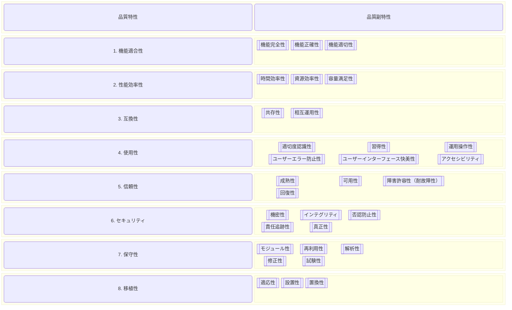

# tl;dr

- ちょっと図が書きたくて mermaid を見たら新しい？ダイアグラムが増えてるみたいだったのでテスト
- VS Code のエクステンションではちゃんと表示されるけど、GitHub と Zenn ではどうかなって

# block diagram

- [Mermaid | Diagramming and charting tool](https://mermaid.js.org/)
- [Block Diagram Syntax | Mermaid](https://mermaid.js.org/syntax/block.html)

# システム開発の品質特性

- ISO/IEC 9126 → ISO/IEC 25010（日本語版：JIS X 25010） → 8 の品質特性と 31 の品質副特性に分類
- 書きたいのはコレじゃなかったんだけど、雰囲気はこういうのだったので例ということでひとつ

## 画像（念のため）


## 動くかな



# コード

```graph
block
    columns 1
    %% この columns 指定で縦並びを実現（この高さの block が１列になる）
    block
        no0_1("品質特性")
        no0_2("品質副特性")
    end

    block
        columns 2
        no1("1. 機能適合性"):1
        block
            columns 3
            no1_1[["機能完全性"]]:1
            no1_2[["機能正確性"]]:1
            no1_3[["機能適切性"]]:1
        end
    end

    block
        columns 2
        no2("2. 性能効率性")
        block
            columns 3
            no2_1[["時間効率性"]]:1
            no2_2[["資源効率性"]]:1
            no2_3[["容量満足性"]]:1
        end
    end

    block
        columns 2
        no3("3. 互換性")
        block
            columns 3
            no3_1[["共存性"]]:1
            no3_2[["相互運用性"]]:1
        end
    end

    block
        columns 2
        no4("4. 使用性")
        block
            columns 3
            no4_1[["適切度認識性"]]:1
            no4_2[["習得性"]]:1
            no4_3[["運用操作性"]]:1
            no4_4[["ユーザーエラー防止性"]]:1
            no4_5[["ユーザーインターフェース快美性"]]:1
            no4_6[["アクセシビリティ"]]:1
        end
    end

    block
        columns 2
        no5("5. 信頼性")
        block
            columns 3
            no5_1[["成熟性"]]:1
            no5_2[["可用性"]]:1
            no5_3[["障害許容性（耐故障性）"]]:1
            no5_4[["回復性"]]:1
        end
    end

    block
        columns 2
        no6("6. セキュリティ")
        block
            columns 3
            no6_1[["機密性"]]:1
            no6_2[["インテグリティ"]]:1
            no6_3[["否認防止性"]]:1
            no6_4[["責任追跡性"]]:1
            no6_5[["真正性"]]:1
        end
    end

    block
        columns 2
        no7("7. 保守性")
        block
            columns 3
            no7_1[["モジュール性"]]:1
            no7_2[["再利用性"]]:1
            no7_3[["解析性"]]:1
            no7_4[["修正性"]]:1
            no7_5[["試験性"]]:1
        end
    end

    block
        columns 2
        no8("8. 移植性")
        block
            columns 3
            no8_1[["適応性"]]:1
            no8_2[["設置性"]]:1
            no8_3[["置換性"]]:1
        end
    end
```

# note

- 一番上の block に対応する end は不要（最後に end を足すとエラーになる）
- `columns` の後ろにコロンがあると違うものになってしまう
- コメント `%%` が文の先頭である必要があるみたい（行中の後ろには書けないみたい）
- 自動調整は期待どおりって意味ではないので、調整めんどくさい
- 左のカラムを小さくするうまい書き方がわからない

# まとめない

- テーブルを書けば済むよね
- notion でテーブルに落とし込んでたやつを取り出してみただけなんだけど
- 図中のアイテムからリンクを貼れるとかもう少しいろいろできないと選択の意味がないかも
- 図面引く練習ということでひとつ
